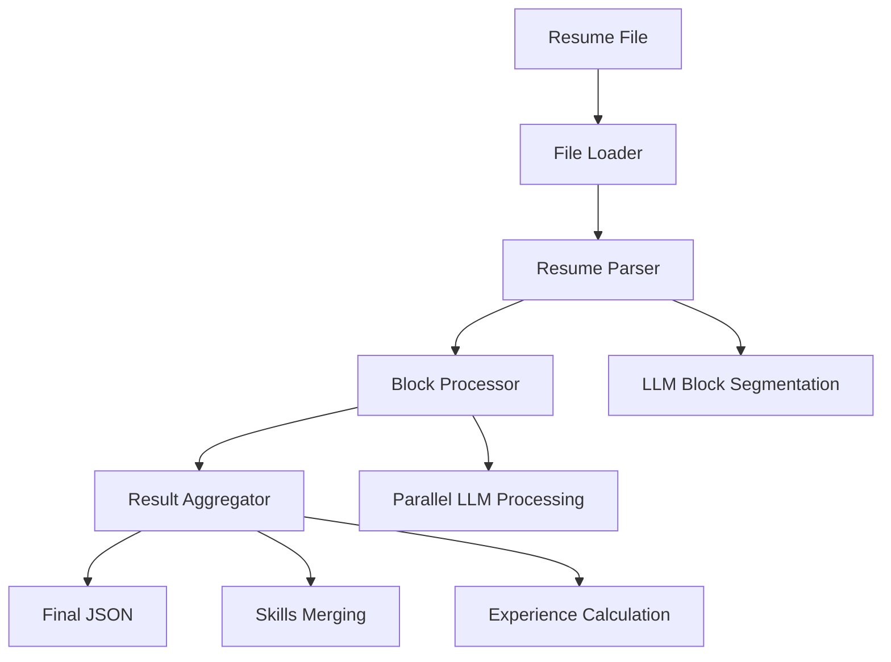

# 🤖 Resume Analyzer

[](https://python.org)
[](https://fastapi.tiangolo.com)
[](https://docker.com)
[](LICENSE)
[](https://black.readthedocs.io)

> **AI-powered resume analysis service** using local LLM (LM Studio) with intelligent block processing, skills extraction, and experience calculation.

## ✨ Features

- 🧠 **LLM-Powered Analysis** - Uses local LLM (LM Studio) for intelligent resume parsing
- 📄 **Multi-Format Support** - Handles DOCX and PDF resume files
- ⚡ **Parallel Processing** - Concurrent block processing for faster analysis
- 🎯 **Smart Skills Extraction** - Deduplication and scoring of technical skills
- 💼 **Experience Calculation** - Automatic work experience calculation from roles
- 🌍 **Multi-Language Support** - Analyzes resumes in various languages
- 🐳 **Docker Ready** - Complete containerization with Docker Compose
- 🧪 **Comprehensive Testing** - Unit and integration tests with unittest
- 🏗️ **SOLID Architecture** - Clean, maintainable code following SOLID principles

## 🚀 Quick Start

### Prerequisites

- **Python 3.11+**
- **LM Studio** - Download from [lmstudio.ai](https://lmstudio.ai/)
- **Docker** (optional) - For containerized deployment

### 1. Clone the Repository

```bash
git clone https://github.com/yourusername/resume-analyzer.git
cd resume-analyzer
```

### 2. Install Dependencies

```bash
pip install -r requirements.txt
```

### 3. Start LM Studio

1. Download and install [LM Studio](https://lmstudio.ai/)
2. Load model: `google/gemma-3-12b` or `meta-llama-3.1-8b-instruct`
3. Start local server on port 1234

### 4. Run the Service

```bash
python run.py
```

### 5. Access the API

- **Swagger UI**: http://localhost:8000/docs
- **Health Check**: http://localhost:8000/health
- **API Base**: http://localhost:8000

## 🐳 Docker Deployment

### Quick Start with Docker

```bash
# Build and run with Docker Compose
docker-compose up --build

# Or use the provided scripts
./docker-scripts/run.sh    # Linux/macOS
.\docker-scripts\run.ps1   # Windows PowerShell
```

### Development Mode

```bash
# Run in development mode with live reload
docker-compose -f docker-compose.dev.yml up --build

# Or use the provided scripts
./docker-scripts/dev.sh    # Linux/macOS
.\docker-scripts\dev.ps1   # Windows PowerShell
```

## 📋 API Documentation

### POST `/analyze`

Upload and analyze a resume file using HTML chunking for better structure preservation (DOCX/PDF).

**Request:**
```bash
curl -X POST "http://localhost:8000/analyze" \
     -H "Content-Type: multipart/form-data" \
     -F "file=@resume.pdf"
```

**Response:**
```json
{
  "skills_from_resume": [
    {"name": "Java", "score": 85},
    {"name": "Spring Boot", "score": 80},
    {"name": "Microservices", "score": 75}
  ],
  "skills_merged": [
    {"name": "Java", "score": 85, "merged": 2},
    {"name": "Spring Boot", "score": 80, "merged": 1},
    {"name": "Microservices Architecture", "score": 75, "merged": 3}
  ],
  "roles": [
    {
      "title": "Senior Software Architect",
      "project": "Polixis SA",
      "duration": "1 year 9 months",
      "score": 90,
      "category": ["Engineering", "Architecture"]
    }
  ],
  "languages": [
    {"language": "English", "level": "Advanced"},
    {"language": "Armenian", "level": "Native"}
  ],
  "experience": "20+ years",
  "location": "Armenia",
  "ready_to_remote": true,
  "ready_to_trip": true
}
```

## 🏗️ Architecture

### Core Components

```
resume-analyzer/
├── 🧠 core/                    # Core business logic
│   ├── resume_parser.py        # LLM-based resume parsing
│   ├── block_processor.py      # Parallel block processing
│   ├── experience_calculator.py # Experience calculation
│   ├── aggregation/            # Result aggregation
│   │   ├── resume_result_aggregator.py
│   │   ├── skill_merger.py
│   │   └── experience_analyzer.py
│   └── prompts/                # LLM prompt templates
│       ├── prompt_base.py
│       ├── parsing_prompts.py
│       ├── project_prompts.py
│       ├── skill_prompts.py
│       └── language_prompts.py
├── 🔌 services/                # External services
│   ├── llm_client.py          # LM Studio integration
│   └── file_loader.py         # DOCX/PDF processing
├── 🧪 tests/                   # Test suite
│   ├── unit/                  # Unit tests
│   └── integration/           # Integration tests
├── 🐳 docker-scripts/         # Docker management
├── 📄 main.py                 # FastAPI application
└── 🚀 run.py                  # Service runner
```

### Processing Pipeline



### Block Types

1. **`projects`** - Work experience and roles
2. **`skills`** - Technical skills and competencies
3. **`education`** - Education and certifications
4. **`languages`** - Language proficiency
5. **`summary`** - General information and overview

## ⚙️ Configuration

### Environment Variables

```bash
# LM Studio settings
LM_STUDIO_URL=http://localhost:1234/v1/chat/completions
DEFAULT_MODEL=google/gemma-3-12b
DEFAULT_MAX_TOKENS=4096
DEFAULT_TEMPERATURE=0.0
DEFAULT_SEED=42

# Timeout settings
LLM_TIMEOUT=120

# Logging
LOG_LEVEL=INFO
```

### Model Configuration

Edit `config.py` to change the LLM model:

```python
# Available models
DEFAULT_MODEL = "google/gemma-3-12b"           # Recommended
# DEFAULT_MODEL = "meta-llama-3.1-8b-instruct"  # Alternative
```

## 🧪 Testing

### Run All Tests

```bash
# Run complete test suite
python tests/run_all_tests.py

# Run with verbose output
python tests/run_all_tests.py -v
```

### Individual Test Categories

```bash
# Unit tests
python -m unittest tests.unit.test_resume_parser -v
python -m unittest tests.unit.test_block_processor -v
python -m unittest tests.unit.test_experience_calculator -v

# Integration tests
python -m unittest tests.integration.test_full_pipeline -v
```

### Test Coverage

```bash
# Run tests with coverage
pytest tests/ --cov=core --cov=services --cov-report=html
```

## 🛠️ Development

### Code Quality

```bash
# Format code
black .
isort .

# Lint code
flake8 .

# Type checking
mypy core/ services/
```

### Using Makefile

```bash
make format      # Format code
make lint        # Lint code
make type-check  # Type checking
make test        # Run tests
make clean       # Clean temporary files
make quality-check  # Full quality check
```

### Development Dependencies

```bash
pip install -r requirements-dev.txt
```

## 📊 Performance

### LLM Optimization

- **Fixed Seed**: `seed=42` for consistent results
- **Smart Temperature Control**:
  - Skills & Projects: `temperature=0.0` (deterministic)
  - Summary: `temperature=0.7` (creative)
  - Education: `temperature=1.0` (maximum creativity)
- **Parallel Processing**: Concurrent block processing
- **Timeout Management**: 120s timeout per LLM request

### Benchmarks

- **Processing Time**: ~30-60 seconds per resume
- **Memory Usage**: ~200-300MB
- **Docker Image Size**: ~500MB
- **Startup Time**: ~10-15 seconds

## 🔧 Troubleshooting

### Common Issues

#### LM Studio Connection Error
```bash
# Check if LM Studio is running
curl http://localhost:1234/v1/models

# Start LM Studio and load a model
```

#### File Format Issues
```bash
# Supported formats: DOCX, PDF
# Check file size (max 10MB)
# Ensure file is not corrupted
```

#### Docker Issues
```bash
# Check Docker is running
docker version

# Rebuild containers
docker-compose down
docker-compose up --build
```

### Logs

- **Application Logs**: `resume_analyzer.log`
- **Docker Logs**: `docker-compose logs -f resume-analyzer`
- **Log Level**: Set via `LOG_LEVEL` environment variable

## 📚 Documentation

- **[DEVELOPMENT.md](DEVELOPMENT.md)** - Detailed development guide
- **[DOCKER.md](DOCKER.md)** - Docker setup and configuration
- **[TESTING_GUIDE.md](TESTING_GUIDE.md)** - Testing documentation
- **[CONFIG.md](CONFIG.md)** - Configuration reference

## 🤝 Contributing

1. Fork the repository
2. Create a feature branch (`git checkout -b feature/amazing-feature`)
3. Commit your changes (`git commit -m 'Add amazing feature'`)
4. Push to the branch (`git push origin feature/amazing-feature`)
5. Open a Pull Request

### Development Setup

```bash
# Clone your fork
git clone https://github.com/yourusername/resume-analyzer.git

# Install development dependencies
pip install -r requirements-dev.txt

# Run tests
python tests/run_all_tests.py

# Format code
black .
isort .
```

## 📄 License

This project is licensed under the MIT License - see the [LICENSE](LICENSE) file for details.

## 🙏 Acknowledgments

- [LM Studio](https://lmstudio.ai/) for local LLM hosting
- [FastAPI](https://fastapi.tiangolo.com/) for the web framework
- [Google Gemma](https://ai.google.dev/gemma) and [Meta Llama](https://llama.meta.com/) for the language models

## 📞 Support

- **Issues**: [GitHub Issues](https://github.com/yourusername/resume-analyzer/issues)
- **Discussions**: [GitHub Discussions](https://github.com/yourusername/resume-analyzer/discussions)
- **Documentation**: [Wiki](https://github.com/yourusername/resume-analyzer/wiki)

---

<div align="center">

**Made with ❤️ for the developer community**

[⭐ Star this repo](https://github.com/yourusername/resume-analyzer) | [🐛 Report Bug](https://github.com/yourusername/resume-analyzer/issues) | [💡 Request Feature](https://github.com/yourusername/resume-analyzer/issues)

</div>